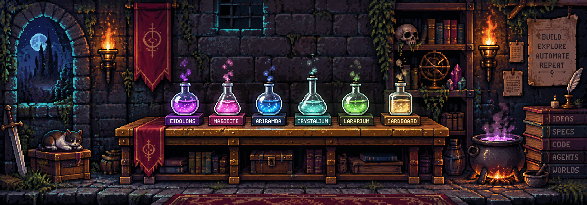

<p align="center">
  
</p>

<h1 align="center">Henrique A. Lavezzo · Rynaro</h1>

<p align="center">
  
</p>

<p align="center">
  
  
  <a href="https://hlavezzo.me"></a>
</p>

<p align="center"><em>Rynaro comes from nowhere, and appears exactly where he is needed.</em></p>

## Artifacts

<p align="center">
  <a href="https://github.com/Rynaro/eidolons"></a>
  <a href="https://github.com/Rynaro/magicite"></a>
  <a href="https://github.com/Rynaro/ariramba"></a><br/>
  <a href="https://github.com/Rynaro/crystalium"></a>
  <a href="https://github.com/Rynaro/lararium"></a>
  <a href="https://github.com/Rynaro/cardboard-box"></a>
</p>

<p align="center">
  
</p>

<details>
<summary><b>What each flask holds</b></summary>

<br/>

- **Eidolons** · deterministic party routing for Claude Code / Cursor / Copilot / Codex / OpenCode  
- **Magicite** · local MCP skill registry (routes & audits; never executes)  
- **Ariramba** · every model action is a proposal, not permission  
- **Crystalium** · four-layer shared memory for the party  
- **Lararium** · warm Claude Code companion with zero guilt  
- **Cardboard Box** · Distrobox craft outside the AI fog  

</details>


<details>
<summary><b>First circle</b> · newcomers (click)</summary>

<br/>

```bash
curl -fsSL https://raw.githubusercontent.com/Rynaro/eidolons/main/cli/install.sh | bash
mkdir atelier-demo && cd atelier-demo
eidolons init --preset minimal --hosts claude-code --non-interactive --no-mcp
eidolons harness install
```

> ATLAS, map how authentication works in this repository. Cite entry points and tests. Keep this read-only.

</details>

<details>
<summary><b>The alembic's rules</b></summary>

<br/>

Orchestration, not spectacle. Evidence over theater. Boundaries you can hold. Claim only what the measurement supports.

</details>

<p align="center">
  <a href="https://hlavezzo.me"></a>
  <a href="https://github.com/Rynaro/alchemists-orchid"></a>
  
</p>
